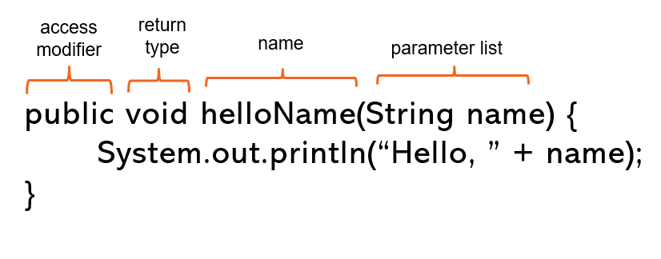

# Instructions  
### Description:
A method in Java is a block of code that represents an action that can happen. A method can take in values and return a value. When we create a method, we need to write it's method signature and code block. 

The **method signature** defines everything about the method: 
- the access modifier specifies its level of access. For now, we will always make our methods **public**, or available throughout the program. We will go over modifying access in a later lab.
- the return type specifies what type of value is returned from the method. If it doesn't return a value, the return type should be **void**
- the name of the method
- the parameter list, which specifies which types of values, if any should be passed into the method when it is called

The method's **code block** contains statements that will run whenever the method is called. 


Below is an example of a method:

This method doesn't return a value, is named **helloName**, and takes in a String value which is saved into the parameter called **name**. In the code block, there is just one statement that prints out a String that has the value in the name parameter concatenated to it.

This activity will help you understand how to use Java methods. Please follow the steps below:

### Steps:
1. Add in the following code the the Duck.java file:
```Java
public class Duck {

  public String waddle() {
    return "*waddle waddle*";
  }

  
}
```
We added in the Duck class definition and the **waddle()** method inside of it. If we take a look at our method's signature, we can see that it returns a String, it's name is **waddle**, and it doesn't take in any input. In the method's code block, we use the **return** keyword to return the String value `*waddle waddle*`.

2. Now it's your turn! Create a method in the Duck class that meets the following requirements:
  - it is named **quack**
  - it doesn't take in any input
  - it returns the following String value: `quack!`

3. Create a Duck object in the **main()** method in Main.java and assign it to a reference variable named **donald**.
4. Now that we have a Duck object to work with, have it use its **waddle()** method by adding in the following statements below what you have so far in the **main()** method:
```Java
String waddling = donald.waddle();
System.out.println(waddling);
```
In the first statement, we called the **waddle()** method by using the reference variable, **donald**. We then saved the returned value into the variable **waddling**. The next statement prints the value to the console. Run the program to test the output. You should get `*waddle waddle*` printed to the console.

5. Lastly, create a statement that has the duck quack by calling the duck's **quack()** method and save the string result into a variable. Print the variable's value to the console.

### Test:
Use the test provided. 

#### Sample output:
```
*waddle waddle*
quack!
```